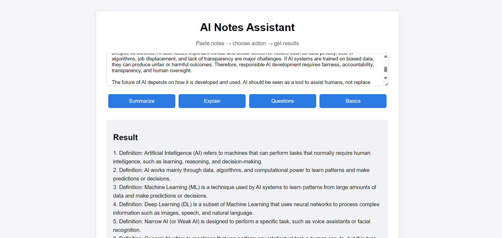
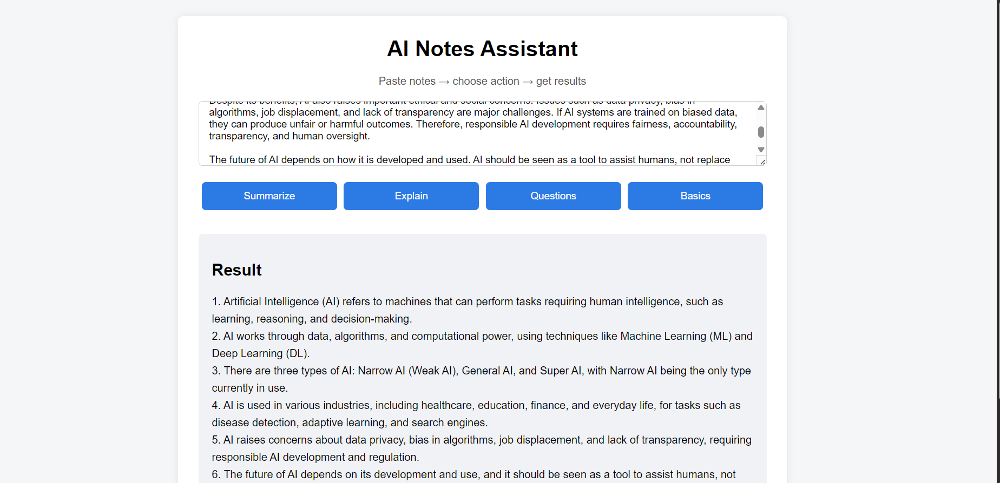
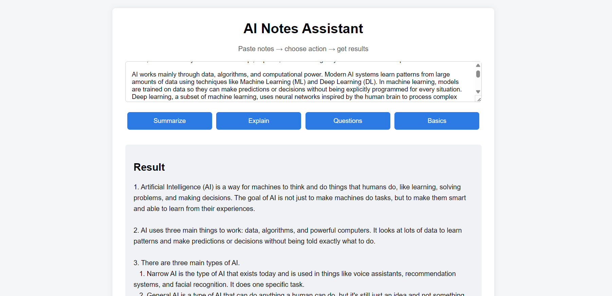
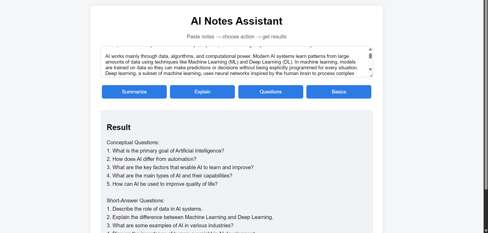

# 🧠 AI Notes Assistant

A task-based AI Notes Assistant built with **Flask** and **LangChain (LCEL)**.  
Paste raw study notes and generate **summaries**, **basic concepts**, and **exam-oriented questions** using LLMs.

This project focuses on **clean backend architecture** and **practical AI integration**, not flashy UI.

---

## 🚀 Features

- 📌 **Summarize Notes** – concise, exam-ready bullet points  
- 📘 **Extract Basics** – foundational concepts with short definitions  
- ❓ **Generate Questions** – conceptual + short-answer questions  
- 🔁 **Task-based AI chains** (not a chatbot)
- ⚙️ Clean separation between UI, Flask routes, and LangChain logic

---

## 🧱 Tech Stack

- **Backend:** Flask  
- **AI Layer:** LangChain (LCEL)  
- **LLM:** HuggingFace (LLaMA-3 Instruct)  
- **Frontend:** HTML, CSS, JavaScript  
- **API Style:** JSON-based communication

---

## 📂 Project Structure

```
project/
│
├── app.py
├── chains/
│   └── note_chains.py
├── templates/
│   └── index.html
├── static/
│   ├── style.css
│   └── script.js
├── .env
└── README.md
```
---
## 🖥️ Project UI

<p align="center">
  <br>
  <em>Main Interface</em>
</p>

<p align="center">
  <br>
  <em>Summary Output</em>
</p>

<p align="center">
  <br>
  <em>Basics Extraction</em>
</p>

<p align="center">
  <br>
  <em>Question Generation</em>
</p>

---

## 🧠 Architecture Overview

User → Flask (`/process`) → Task Selector → LangChain LCEL → LLM → JSON → UI

- Flask handles routing only  
- All prompts live in `chains/`  
- One task = one chain  
- Uses `invoke()` for explicit execution

---

## ⚙️ Setup & Run

### Clone
```bash
git clone https://github.com/imshekhuu/AI-Notes-Assistant.git
cd AI-Notes-Assistant
```

### Environment
```bash
python -m venv venv
source venv/bin/activate
```

### Install
```bash
pip install -r requirements.txt
```

### Environment Variables
Create `.env`:
```
HUGGINGFACEHUB_API_TOKEN=your_api_key_here
```

### Run
```bash
python app.py
```

Open: http://127.0.0.1:5000

---

## 🎯 Why This Project

- Shows real Flask + LangChain integration
- Task-based AI design (better than chatbots)
- Clean, interview-ready architecture

---

## 🔮 Future Improvements

- Add Explain chain
- Streaming responses
- Prompt tuning
- Logging & error handling
- Docker support
